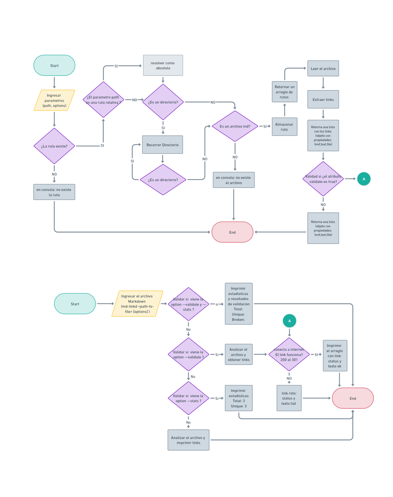
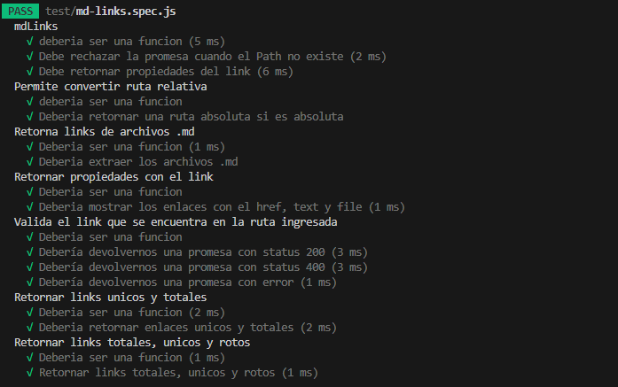

# Markdown Links

Herramienta que lee y analiza archivos en formato Markdown ".md"
para luego verificar los links que contenga y brindar estadísticas.
***
## 1. Instalación

Ejecutar la siguiente linea de comando: 
`npm i mdlinks-ortiz`  o  `npm install mdlinks-ortiz`

## 2. Guia de uso

Se ejecuta de la siguiente manera a través de la **terminal**:

`mdlinks-ortiz <path-to-file> [options]`

Por ejemplo:

```sh
$ mdlinks-ortiz ./some/example.md
File:  ./some/example.md 
Href: http://algo.com/2/3/ 
Text: Link a algo

File: ./some/example.md 
Href: https://otra-cosa.net/algun-doc.html 
Text: algún doc

File: ./some/example.md 
Href: http://google.com/ 
Text: Google
```
Identifica el archivo markdown (a partir de la ruta que recibe como
argumento), analiza el archivo Markdown e imprimir los links que vaya
encontrando, junto con la ruta del archivo donde aparece y el texto
que hay dentro del link (truncado a 50 caracteres).

#### Options

##### `--validate`

`mdlinks-ortiz <path-to-file> --validate`

El módulo realizá una petición HTTP donde averigua si el link funciona o no.

Por ejemplo:

```sh
$ mdlinks-ortiz ./some/example.md --validate
File:     ./some/example.md 
Href:     http://algo.com/2/3/ 
mesagge:  ok
Status:   200 
Text:     Link a algo

File:     ./some/example.md
Href:     https://otra-cosa.net/algun-doc.html 
Message:  fail
Status:   404     
Text:     algún doc

File:     ./some/example.md
Href:     http://google.com/
Message:  ok 
Status:   301
Text:     Google
```

Vemos que el _output_ en este caso incluye la palabra `ok` o `fail` después de
la URL, así como el status de la respuesta recibida a la petición HTTP a dicha
URL.

##### `--stats`

`mdlinks-ortiz <path-to-file> --stats`

Si pasamos la opción `--stats` el output (salida) será un texto con estadísticas
básicas sobre los links.

```sh
$ mdlinks-ortiz ./some/example.md --stats
Total:   3
Unique:  3
```

También podemos combinar `--stats` y `--validate` para obtener estadísticas que
necesiten de los resultados de la validación.

```sh
$ mdlinks-ortiz ./some/example.md --stats --validate
Total:  3
Unique: 3
Broken: 1
```


***
## Sobre el proyecto 

Markdown es un lenguaje de marcado ligero es usado en muchísimas plataformas que
manejan texto plano (GitHub, foros, blogs, ...) y es muy común
encontrar varios archivos en ese formato en cualquier tipo de repositorio
(empezando por el tradicional `README.md`).

Estos archivos `Markdown` normalmente contienen _links_ (vínculos/ligas) que
muchas veces están rotos o ya no son válidos y eso perjudica mucho el valor de
la información que se quiere compartir.

Dentro de una comunidad de código abierto, nos han propuesto crear una
herramienta usando [Node.js](https://nodejs.org/), que lea y analice archivos
en formato `Markdown`, para verificar los links que contengan y reportar
algunas estadísticas.

## Plan de Acción 

Organicé las tareas en GitHub-projects, desarroll el diagrama de flujo e
instale las dependencias que necesitaba.

### Diagrama de flujo 


## Pruebas Unitarias
 Para las pruebas unitarias utilice Jest.

 